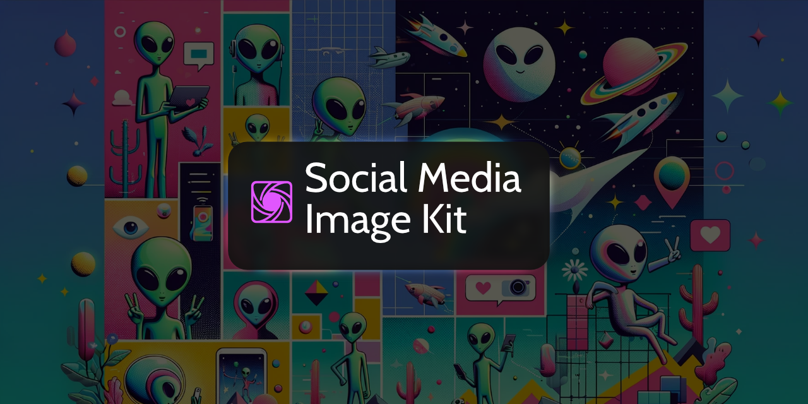

Social Media Image Kit provides a framework to help generate social media images for collection entries using Antlers or Blade templates.

Social Media Image Kit provides the following features:

1. **Simple image management**: Social Media Image Kit ships with a custom fieldtype, making it simple to manage generated social media images (or replace them with custom ones)
2. **Customizable templates and image sizes**: generate an arbitrary number of images for a variety of platforms. Update the existing default template, or create specific collection or blueprint templates for maximum flexibility
3. **Battle-tested rendering**: The default template renderer uses [Spatie's amazing Browsershot](https://spatie.be/docs/browsershot/v2/introduction) packaging, making finding guidance on installing and configuring Puppeteer easier
4. **Automation and Queue support**: Social Media Image Kit can be configured to generate images whenever someone changes an entry in the control panel. Generation can be dispatched to a queue, with advanced options for preventing duplicate jobs
5. **Assets and filesystem disks**: Social Media Image Kit stores all images as asset. It can also be configured to use a custom filesystem disk to easily store images locally, on AWS S3, or any other supported storage provider.
6. And a whole lot more!

## Installation and Documentation

Documentation for Social Media Image Kit can be found online at https://stillat.com/social-media-image-kit/v1/installation

## License

Social Media Image Kit is open-source software, released under the GPL-3.0 license.