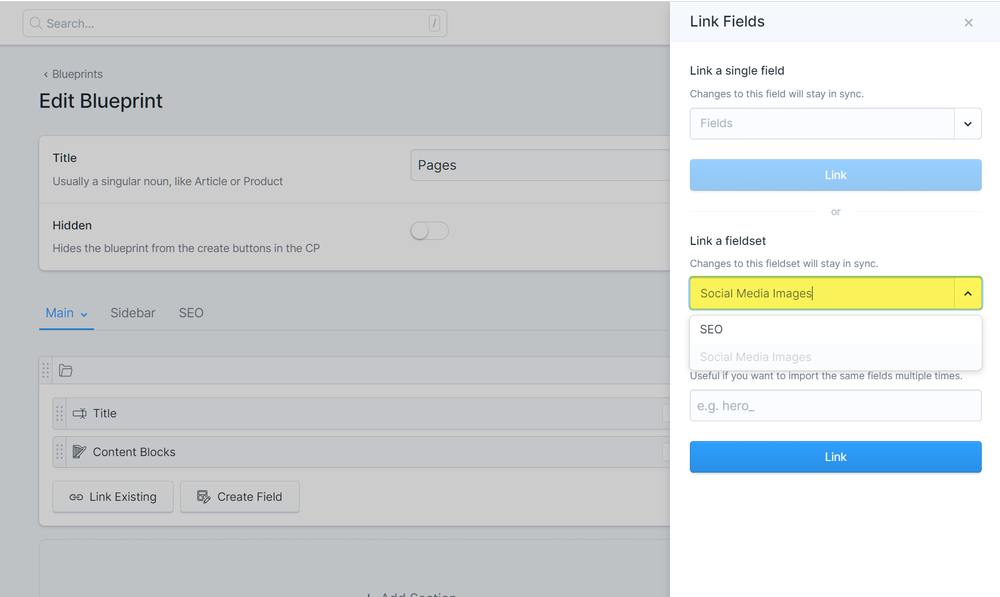
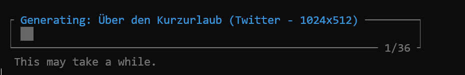
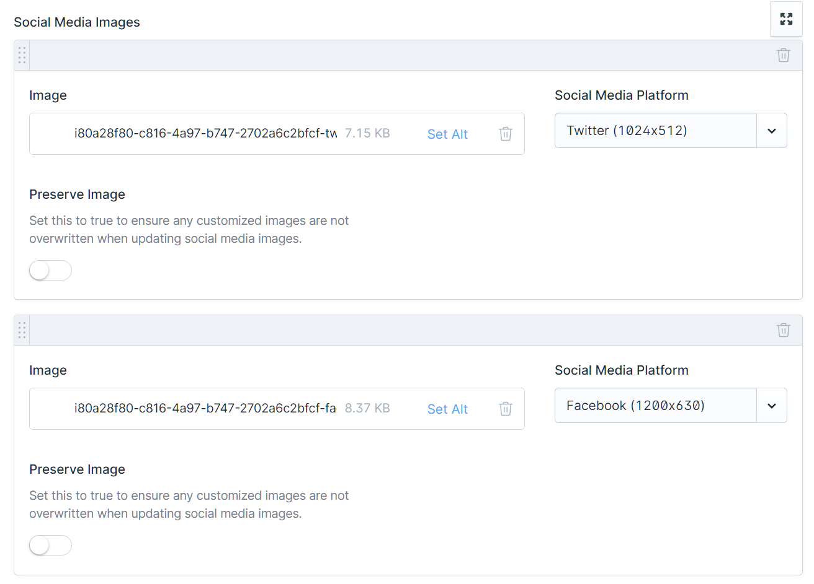

# Social Media Image Kit

Social Media Image Kit is a Statamic addon to help generate and manage social media images for your site's entries.

This addon provides the foundational logic and plumbing to implement automated image generation for your site, and ships with an easily configurable HTML render based on the excellent [Browsershot](https://spatie.be/docs/browsershot/v2/installation-setup) package.

## How to Install

To install Social Media Image Kit please run the following command from the root of your project:

**NOTE: This is not currently available on packagist, and will need to be symlinked.**

``` bash
composer require stillat/social-media-image-kit
```

After installing the addon using composer, you will need to run the following command from the root of your project:

```bash
php artisan vendor:publish --tag=social-media-image-kit
```

This command will publish the required public assets as well as a handful of configuration files.

If you intend to use the provided Browsershot, you will also need to ensure that Puppeteer is installed and configured on your system. For more information on how to do this, please consult the Browsershot documentation at https://spatie.be/docs/browsershot/v2/requirements

The following documentation will include screenshots taken from a new [Multisimplicity](https://statamic.com/starter-kits/statamic/multisimplicity) starter kit installation. Its a pretty neat starter kit - you should check it out!

### Step 1: Creating the Asset Container

Social Media Image Kit requires an asset container in order to store generated images in. By default, it will look for an asset container with the handle `social_media_images`.

You will need to ensure this asset container exists before continuing. If you'd like a more guided process to setup this container, you may run the following command from the root of your project:

```bash
php artisan social-media-image-kit:install-asset-container
```

You will be prompted to select one of your site's predefined filesystem disks during installation.

If you already have an asset container with the handle `social_media_images` that you don't want to use for Social Media Image Kit, you can update the following value within your `config/social_media_image_kit/general.php` file:

```php
<?php

return [

    // ...

    /*
    |--------------------------------------------------------------------------
    | Asset Container
    |--------------------------------------------------------------------------
    |
    | This option defines the Statamic asset container utilized by the Social
    | Media Image Kit for image storage. Once this option is set, it should
    | not be changed. Doing so may result in broken images for entries.
    |
    */

    'asset_container' => 'social_media_images',

    // ...

];
```

### Step 2: Configuring Collections Entry Blueprints

In order for Social Media Image Kit to work correctly, we need to link the provided "Social Media Images" fieldset within the blueprint for *each* collection we want to generate images for.

> Important: Do *not* apply a field prefix when importing this fieldset.

This fieldset provides a handful of important fields that Social Media Image Kit uses to keep images organized and associated with each entry.



Once the blueprints have been configured, we need to tell Social Media Image Kit which collections it should process. To do so, add the handle of each collection within the `collections` option inside your `config/social_media_image_kit/general.php` file:

```php
<?php

return [

    // ...

    /*
    |--------------------------------------------------------------------------
    | Collection Handles for Image Generation
    |--------------------------------------------------------------------------
    |
    | The 'collections' array specifies which collection handles the Social Media
    | Image Kit addon will reference to retrieve entries. Only collections that
    | appear in this array will be used to generate social media images for.
    |
    */

    'collections' => [
        'pages',
        'blog',
    ],

    // ...

];
```

### Step 3: Updating the Template

By default, Social Media Image Kit will create a new file within your views directory:

```
resources/views/social-media-image-kit/_default.antlers.html
```

This template will be used when generating the images for each of your site's entries. Feel free to modify this however you'd like to meet your site's overall look and feel 🙂

### Step 4: Test Things Out

At this point, we should be able to run the following Artisan command from the root of our project:

```bash
php artisan social-media-image-kit:generate-images
```

If installation and configuration was a success, we should see a progress bar indicating that social media images are being generated:



If you receive a `Symfony\Component\Process\Exception\ProcessFailedException` and the error message mentions Puppeteer you may have skipped part of the installation process. If you intend to use the provided Browsershot, you will also need to ensure that Puppeteer is installed and configured on your system. For more information on how to do this, please consult the Browsershot documentation at https://spatie.be/docs/browsershot/v2/requirements.

### Step 5: View the Control Panel

After your images have generated you can manage them in the Control Panel (on whichever tab or section you linked the fieldset previously). When viewing any entry, you should see something similar to the following:



Each image generated will appear as a row within the Social Media Images grid. The social media platform the image was generated for will appear next to the actual asset, as well as its resolution. This should never be changed from the Control Panel, and is read only by default.

If you'd like, you can select a different asset for any of the images. If you do, be sure to toggle the "Preserve Image" field to `true`. If you don't, Social Media Image Kit will regenerate the image the next time the command is ran and remove your amazing custom image!

## Configuring Social Media Image Sizes and Platforms

You may customize the social media images created by Social Media Image Kit by modifying the `config/social_media_image_kit/images.php` configuration file.

Each configured size must have the following properties:

* handle: A unique handle to internally represent the social media platform. This value should not contain special characters or spaces, and should not be changed once set as it is used to link attributes and other meta-data to images within the Social Media Images asset container.
* name: The name is used to help identify what size the site is for; its purely informational and will be displayed within the Control Panel.
* width: The width of the final image, in pixels.
* height: The height of the final image, in pixels.
* attributes: A list of attributes that will be added to the rendered meta tag.

By default, the following profiles are available to help get you started:

```php

<?php

return [

    'profiles' => [
        [
            'handle' => 'twitter',
            'name' => 'Twitter',
            'width' => 1024,
            'height' => 512,
            'attributes' => [
                'name' => 'og:image',
            ],
        ],
        [
            'handle' => 'facebook',
            'name' => 'Facebook',
            'width' => 1200,
            'height' => 630,
            'attributes' => [
                'property' => 'og:image',
            ],
            'meta_tags' => [
                [
                    'property' => 'og:image:width',
                    'content' => '$width',
                ],
                [
                    'property' => 'og:image:height',
                    'content' => '$height',
                ],
                [
                    'property' => 'og:image:alt',
                    'content' => '$alt',
                ],
                [
                    'property' => 'og:image:type',
                    'content' => '$mime_type',
                ],
            ],
        ],
    ],

];

```

## Customizing Templates

Social media images are generated by rendering Antlers (or Blade) templates and then converting the resulting HTML into an image. By default templates are stored in the following directory:

```
resources/views/social-media-image-kit/
```

You can create different templates for each collection/blueprint combination by creating template files using the following naming convention:

```
resources/views/social-media-image-kit/<collection_handle>/<blueprint_handle>.antlers.html
```

When creating templates, be sure to keep the following considerations in mind:

* Templates are rendered using raw HTML, and do not make a request to your site for each page
* When running your site using commands like `php artisan serve` and your template makes use of images or other assets, be sure this is still running when you generate social media images


## Configuring the Browsershot Instance

Not all systems are created equal, and sometimes you may need to modify the Browsershot settings. To modify the settings, you can use the `Stillat\SocialMediaImageKit\SocialMediaImageKit` helper class.

For instance, you could place something like this in your `AppServiceProvider` if running on Windows:

```php
<?php

namespace App\Providers;

use Illuminate\Support\ServiceProvider;
use Stillat\SocialMediaImageKit\Support\Facades\SocialMediaImageKit;

class AppServiceProvider extends ServiceProvider
{
    /**
     * Bootstrap any application services.
     */
    public function boot(): void
    {
        SocialMediaImageKit::configureBrowsershot(function (Browsershot $browsershot) {
            $browsershot->setCustomTempPath('C:/chromedata/tmp')
                ->setUserDataDir('C:/chromedata')
                ->setNodeBinary('C:/Program Files/nodejs/node.exe')
                ->waitUntilNetworkIdle()
                ->newHeadless()
                ->noSandbox();
        });
    }
}

```

> Warning: Only apply general settings. The window size will be set Social Media Image Kit.

## Rendering META Tags

Generating social media images is great, but doesn't do much good if we don't output the meta tags to make them discoverable.

We can do that by adding the following Antlers snippet to your site's `<head></head>`:

```antlers
{{ get_social_media_images /}}
```
